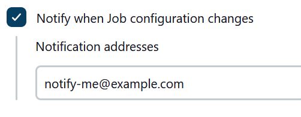

# Mail Watcher

This plugin notifies configured email recipients on various events.

# Recipients configuration

Plugin optional configuration section is attached to the watched entity and usually called "Notify when ...".

Configuration accepts list of addresses delimited by comas.

## Watched events

Recommended Jenkins version for Mail Watcher Plugin is 1.554 or later. Using earlier version (earlier than 1.551) will cause missing notification for events that was not supported in the particular version.

### Job configuration

Notify when Job configuration changes. Recipients are configured at job configuration page. Recipients are notified when one of these events occurs:

- [`onRenamed`](https://javadoc.jenkins.io/hudson/model/listeners/ItemListener.html#onRenamed(hudson.model.Item,%20java.lang.String,%20java.lang.String))
- [`onDeleted`](https://javadoc.jenkins.io/hudson/model/listeners/ItemListener.html#onDeleted(hudson.model.Item))
- [`onUpdated`](https://javadoc.jenkins.io/hudson/model/listeners/ItemListener.html#onUpdated(hudson.model.Item))

### Node online status

Notify when Node online status changes. Recipients are configured at node configuration page, section Node Properties. Recipients are notified when one of these events occurs:

- [`onOffline`](https://javadoc.jenkins.io/hudson/slaves/ComputerListener.html#onOffline(hudson.model.Computer))
- [`onOnline`](https://javadoc.jenkins.io/hudson/slaves/ComputerListener.html#onOnline(hudson.model.Computer,%20hudson.model.TaskListener))
- [`onTemporarilyOffline`](https://javadoc.jenkins.io/hudson/slaves/ComputerListener.html#onTemporarilyOffline(hudson.model.Computer,%20hudson.slaves.OfflineCause))
- [`onTemporarilyOnline`](https://javadoc.jenkins.io/hudson/slaves/ComputerListener.html#onTemporarilyOnline(hudson.model.Computer))

Computer configuration offers two recipients lists for users to be notified on either online or offline event.

### Implicit notifications

- User is notified when the node he/she put offline becomes available. In other words: last build has finished and no new can be scheduled. (Since 1.551)
